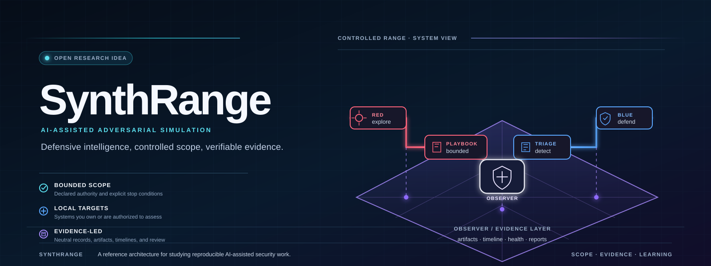

**An open research idea for AI-assisted adversarial simulation and defensive intelligence.**

[](https://github.com/akinteldev/synthrange/actions/workflows/ci.yml)
[](LICENSE)

SynthRange is an open research idea and reference implementation for AI-assisted adversarial simulation ranges. It sketches how autonomous Red and Blue agents, target adapters, composable playbooks, and an evidence-driven Observer layer fit into one architecture for assessing systems you own—across web applications and, in the documented direction, Linux, Windows, and macOS—so that a run produces reproducible evidence, detections, and defensive intelligence.

The repository publishes the architecture, the versioned contracts, the components that exist today, and one sanitized illustrative run brief. It is offered for study, critique, and contribution rather than as a supported product or turnkey tool.

## Architecture

SynthRange separates five responsibilities:

- **Red** performs adversarial work within a playbook and run scope.
- **Blue** investigates, detects, and develops defensive intelligence.
- **Targets** provide reproducible systems and applications to assess.
- **Traffic Proxy** records and optionally constrains web traffic.
- **Observer** collects artifacts and produces the neutral run record.

Red and Blue may use Hermes today, but the architecture is agent-framework independent.


## Current status

| Area | Status |
|---|---|
| Red Hermes agent | Available in the reference lab; public integration template planned |
| Blue Hermes agent | Available in the reference lab; autonomous finalization remains Prototype |
| Observer evidence helpers | Available; lifecycle and approval hardening available in source, lab rollout pending |
| Traffic Proxy addon | Available; mechanical pacing and budget policy available in source, lab rollout pending |
| Juice Shop target adapter | Available; machine-readable contract and Compose deployment |
| Initial composable playbooks | Available: shared evidence baseline, Red web discovery, Blue web triage |
| Observer UI | Prototype; source exists but is not deployed in the reference lab |
| Linux, Windows, and macOS targets | Planned |
| Whole-range automated deployment | Planned |

Status labels mean **Available**, **Prototype**, **Planned**, or **Vision**. Planned architecture is documented openly without being presented as implemented.

There is no zero-to-first-run deployment path in this repository yet, and this preview does not promise one. That boundary is stated so readers can judge the material accurately; it is not a request for contributors to build an installer.

## Start here

1. [Overview](docs/overview.md)
2. [Architecture](docs/architecture.md)
3. [Core concepts](docs/concepts.md)
4. [Getting started](docs/getting-started.md)
5. [Playbooks](playbooks/README.md)
6. [Targets](targets/README.md)
7. [Contracts and schemas](schemas/README.md)
8. [Development](docs/development.md)
9. [First real run lessons](docs/lessons/first-real-run.md)

## Community

- [Roadmap](ROADMAP.md)
- [Contributing](CONTRIBUTING.md)
- [Governance](GOVERNANCE.md)
- [Code of Conduct](CODE_OF_CONDUCT.md)
- [Security policy](SECURITY.md)
- [Support](SUPPORT.md)
- [Public-readiness review](docs/public-readiness.md)
- [Apache License 2.0](LICENSE)

## Repository map

```text
components/     Observer and Traffic Proxy implementations
docs/           Architecture, concepts, decisions, and review notes
examples/       Sanitized illustrative contract documents
assets/         Canonical SVG diagrams and future approved media
integrations/   Agent-framework integrations, beginning with Hermes
playbooks/      Composable Red, Blue, and shared playbooks
schemas/        Versioned target-adapter and playbook contracts
targets/        Reproducible target adapters
templates/      Run and reporting templates
deploy/         Whole-range deployment material
```

See [`examples/runs/`](examples/runs/README.md) for the sanitized run brief and its created-state document.
