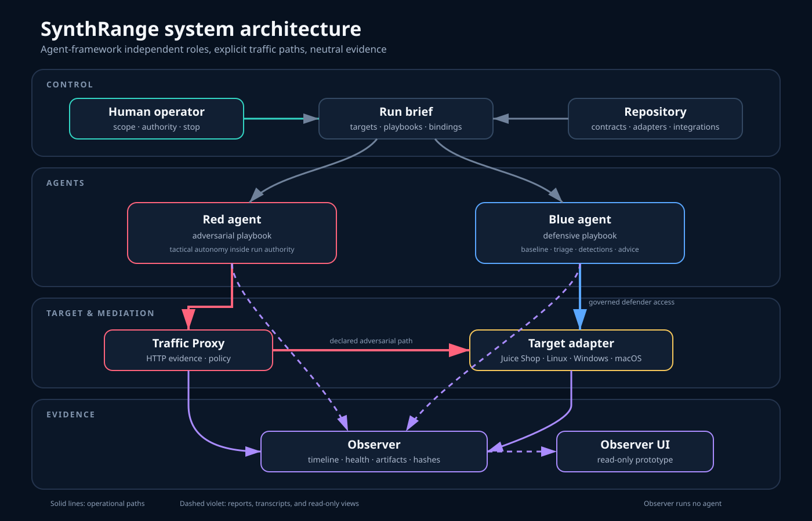

# Architecture

SynthRange separates agent behavior, targets, traffic mediation, and evidence collection so each can evolve independently.

## Logical model

Blue may use direct, governed Target access only when the run brief explicitly grants defensive administration authority. Normal investigation uses immutable, run-scoped telemetry delivered by Observer. Red web traffic can be required through the Traffic Proxy. Observer remains a neutral service host; no Hermes agent runs there in the current reference architecture.

## Components

| Component | Responsibility | Current maturity |
|---|---|---|
| Red integration | Adversarial agent behavior | Available in reference lab |
| Blue integration | Defensive investigation and analysis | Agent available; autonomous finalization Prototype |
| Observer runtime | Collection, lifecycle, approvals, run storage, timeline and reporting | Available in source; hardened lab rollout pending |
| Observer UI | Read-only visualization of Observer artifacts | Prototype |
| Traffic Proxy | HTTP evidence plus host, port, method, rate, burst, budget, and run-ID policy | Available in source; hardened lab rollout pending |
| Juice Shop adapter | Reproducible web target | Available |
| Linux/Windows/macOS adapters | Host target families | Planned |

## Deployment ownership

Component-specific deployment files live beside their component. Top-level `deploy/` is reserved for assembling a complete range. Agent-specific files live under `integrations/`; targets do not depend on a particular agent framework.

## Runtime data

Generated logs, packet captures, certificates, credentials, and run artifacts do not belong in source control by default. Templates and selected sanitized research outputs may be published deliberately.

## Runtime authority

Observer owns the run brief, lifecycle state, approval record, telemetry provenance, final collection, and evidence seal. Agent reports are attributed interpretations; Observer evidence determines measured compliance. Normal run states are `created → preflight → baseline → active → finalizing → stopped → collected → sealed`.

Architecture decisions:

- [Observer-owned telemetry delivery](decisions/0001-observer-owned-telemetry.md)
- [Observer evidence determines compliance](decisions/0002-observer-evidence-authority.md)
- [Explicit run and role lifecycle](decisions/0003-run-lifecycle.md)
- [Quarantine agent-generated self-improvement](decisions/0004-self-improvement-quarantine.md)
