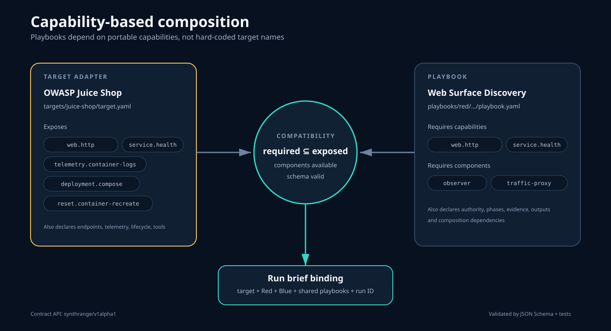

# Core concepts

## Playbook

A reusable mission envelope defining objectives, authority, autonomous decision space, evidence expectations, approval boundaries, and success criteria. A playbook is not a command-by-command walkthrough.

## Target adapter

A reproducible definition for a system or application SynthRange can assess. Adapters declare deployment, endpoints, telemetry, lifecycle, requirements, and portable capabilities such as `web.http` or `service.health`.

## Capability compatibility

A playbook declares the target capabilities and SynthRange components it requires. It is compatible when those capabilities are a subset of the selected target adapter's capabilities and the deployment supplies the required components. The run brief performs the concrete binding.

## Run brief

The concrete, schema-validated activation of one or more playbooks: run ID, target, participants and models, scope, traffic policy, authority, approvals, evidence, lifecycle, and stop conditions.

## Run

One execution of a run brief. Runs produce evidence, timelines, reports, detections, and research findings.

## Run state

Observer's machine-readable lifecycle record for the run and each active role. It makes readiness, activation, finalization, output completeness, stopping, collection, and sealing explicit rather than inferring them from a chat or process.

## Observer

The neutral evidence and run-authority layer. It collects facts from agents, targets, and the Traffic Proxy, delivers read-only telemetry, records approvals and lifecycle, verifies required outputs, and seals the run without being another Red or Blue agent.

## Self-improvement proposal

An agent-generated skill, prompt, or procedure preserved as attributed run evidence. It is not trusted runtime behavior until provenance, safety, generality, tests, and maintainer approval have been reviewed.

## Integration

An adapter between SynthRange and an agent framework. Hermes is the first integration; the architecture does not require every participant or service to run Hermes.
