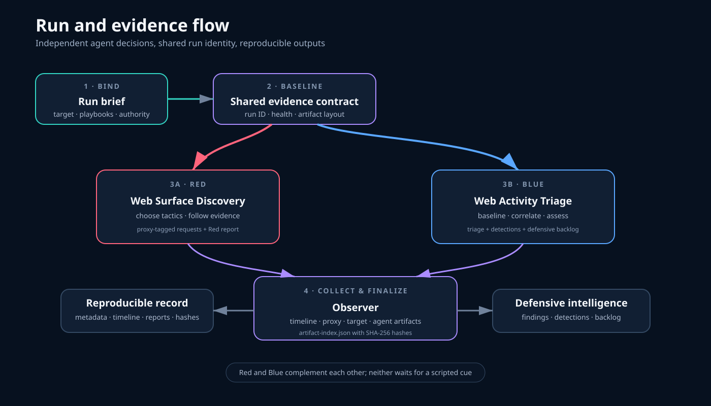

# Composable playbooks

Playbooks are SynthRange's reusable operational contracts. They define objectives, requirements, autonomous decision space, evidence, outputs, and composition—not command-by-command sequences.

Every playbook has a `playbook.yaml` manifest validated by [`schemas/playbook.schema.json`](../schemas/playbook.schema.json).

## Compatibility

```text
Target adapter exposes capabilities
              ↓
Playbook requires capabilities + components
              ↓
Run brief binds playbooks to a concrete target
              ↓
Observer records evidence and outputs
```

A playbook must not name a target merely because that target was used during development. Specialize a playbook only when behavior genuinely depends on a target-specific capability.

## Composition

Playbooks declare:

- `requiresPlaybooks` — contracts that must also be active;
- `complements` — useful peer playbooks that are not strict dependencies.

The first canonical set is:

| Role | Playbook | Purpose |
|---|---|---|
| Shared | [Run Evidence Baseline](shared/run-evidence-baseline/) | Run identity, health, collection, and provenance |
| Red | [Web Surface Discovery](red/web-surface-discovery/) | Autonomous low-impact web discovery |
| Blue | [Web Activity Triage](blue/web-activity-triage/) | Independent evidence-driven defensive analysis |

Red and Blue playbooks both require the shared evidence baseline. They complement each other but do not script each other's decisions.


